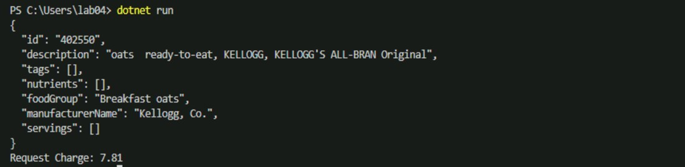
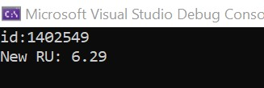

# Indexing in Azure Cosmos DB

In this lab, you will modify the indexing policy of an Azure Cosmos DB container. You will explore how you can optimize indexing policy for write or read heavy workloads as well as understand the indexing requirements for different SQL API query features.

### Recommended Prerequisites 

- [Define indexes in Azure Cosmos DB](https://learn.microsoft.com/en-gb/training/modules/define-indexes-azure-cosmos-db-sql-api/)
- [Customize an indexing policy in Azure Cosmos DB](https://learn.microsoft.com/en-gb/training/modules/choose-indexes-azure-cosmos-db-sql-api/)

## Indexing Overview

Azure Cosmos DB is a schema-agnostic database that allows you to iterate on your application without having to deal with schema or index management. By default, Azure Cosmos DB automatically indexes every property for all items in your container without the need to define any schema or configure secondary indexes. If you chose to leave indexing policy at the default settings, you can run most queries with optimal performance and never have to explicitly consider indexing. However, if you want control over adding or removing properties from the index, modification is possible through the Azure Portal, ARM template, PowerShell, Azure CLI or any Cosmos DB SDK.

Azure Cosmos DB uses an inverted index, representing your data in a tree form. For a brief introduction on how this works, read our [indexing overview](https://docs.microsoft.com/en-us/azure/cosmos-db/index-overview) before continuing with the lab.

## Customizing the indexing policy

In this lab section, you will view and modify the indexing policy for your **FoodCollection**.

### Open Data Explorer

1. On the left side of the portal, select the **Resource groups** link.

2. In the **Resource groups** blade, locate and select the **cosmoslabs** resource group.

3. In the **cosmoslabs** blade, select your **Azure Cosmos DB** account.

4. In the **Azure Cosmos DB** blade, locate and select the **Data Explorer** link on the left side of the blade.

5. In the **Data Explorer** section, expand the **NutritionDatabase** database node and then expand the **FoodCollection** container node.

6. Within the **FoodCollection** node, select the **Items** link.

7. View the items within the container. Observe how these documents have many properties, including arrays. If we do not use a particular property in the WHERE clause, ORDER BY clause, or a JOIN, indexing the property does not provide any performance benefit.

8. Still within the **FoodCollection** node, select the **Scale & Settings** link.
9. Review the **Indexing Policy** section

    - Notice you can edit the JSON file that defines your container's index
    - An Indexing policy can also be modified through any Azure Cosmos DB SDK as well as ARM template, PowerShell or Azure CLI
    - During this lab we will modify the indexing policy through the Azure Portal

   

### Including and excluding Indexes

Instead of including an index on every property by default, you can chose to either include or exclude specific paths from the index. Let's go through some simple examples (no need to enter these into the Azure Portal, we can just review them here).

Within the **FoodCollection**, documents have this schema (some properties were removed for simplicity):

```json
{
    "id": "36000",
    "_rid": "LYwNAKzLG9ADAAAAAAAAAA==",
    "_self": "dbs/LYwNAA==/colls/LYwNAKzLG9A=/docs/LYwNAKzLG9ADAAAAAAAAAA==/",
    "_etag": "\"0b008d85-0000-0700-0000-5d1a47e60000\"",
    "description": "APPLEBEE'S, 9 oz house sirloin steak",
    "tags": [
        {
            "name": "applebee's"
        },
        {
            "name": "9 oz house sirloin steak"
        }
    ],
    "manufacturerName": "Applebee's",
    "foodGroup": "Restaurant Foods",
    "nutrients": [
        {
            "id": "301",
            "description": "Calcium, Ca",
            "nutritionValue": 16,
            "units": "mg"
        },
        {
            "id": "312",
            "description": "Copper, Cu",
            "nutritionValue": 0.076,
            "units": "mg"
        },
    ]
}
```

If you wanted to only index the manufacturerName, foodGroup, and nutrients array, you should define the following index policy. In this example, we use the wildcard character `*` to indicate that we would like to index all paths within the nutrients array.

```json
{
    "indexingMode": "consistent",
    "automatic": true,
    "includedPaths": [
        {
            "path": "/manufacturerName/*"
        },
        {
            "path": "/foodGroup/*"
        },
        {
            "path": "/nutrients/[]/*"
        }
    ],
    "excludedPaths": [
        {
            "path": "/*"
        }
    ]
}
```

However, it's possible we may just want to index the nutritionValue of each array element.

In this next example, the indexing policy would explicitly specify that the nutritionValue path in the nutrition array should be indexed. Since we don't use the wildcard character `*`, no additional paths in the array are indexed.

```json
{
    "indexingMode": "consistent",
    "automatic": true,
    "includedPaths": [
        {
            "path": "/manufacturerName/*"
        },
        {
            "path": "/foodGroup/*"
        },
        {
            "path": "/nutrients/[]/nutritionValue/*"
        }
    ],
    "excludedPaths": [
        {
            "path": "/*"
        }
    ]
}
```

Finally, it's important to understand the difference between the `*` and `?` characters.

The `*` character indicates that Azure Cosmos DB should index every path beyond that specific node.

The `?` character indicates that Azure Cosmos DB should index no further paths beyond this node.

In the above example, there are no additional paths under nutritionValue. If we were to modify the document and add a path here, having the wildcard character `*`  in the above example would ensure that the property is indexed without explicitly mentioning the name.

### Understand query requirements

Before modifying indexing policy, it's important to understand how the data is used in the collection.

If your workload is write-heavy or your documents are large, you should only index necessary paths. This will significantly decrease the amount of RU's required for inserts, updates, and deletes.

Let's imagine that the following queries are the only read operations that are executed on the **FoodCollection** container.

**Query #1**

```sql
SELECT * FROM c WHERE c.manufacturerName = <manufacturerName>
```

**Query #2**

```sql
SELECT * FROM c WHERE c.foodGroup = <foodGroup>
```

These queries only require an index be defined on **manufacturerName** and **foodGroup**. We can modify the indexing policy to index only these properties.

### Edit the indexing policy by including paths

1. In the Azure Portal, navigate back to the **FoodCollection** container
2. Select the **Scale & Settings** link
3. In the **Indexing Policy** section, replace the existing json file with the following:

    ```json
    {
        "indexingMode": "consistent",
        "automatic": true,
        "includedPaths": [
            {
                "path": "/manufacturerName/*"
            },
            {
                "path": "/foodGroup/*"
            }
        ],
        "excludedPaths": [
            {
                "path": "/*"
            }
        ]
    }
    ```

    > This new indexing policy will create an index on only the manufacturerName and foodGroup properties. It will remove indexes on all other properties.

4. Select **Save**. Azure Cosmos DB will update the index in the container, using your excess provisioned throughput to make the updates.

    > During the container re-indexing, write performance is unaffected. Queries run during the index update will not use the new index policy until it has been rebuilt.

5. In the menu, select the **New SQL Query** icon.
6. Paste the following SQL query and select **Execute Query**:

    ```sql
    SELECT * FROM c WHERE c.manufacturerName = "Kellogg, Co."
    ```

7. Navigate to the **Query Stats** tab. You should observe that this query still has a low RU charge, even after removing some properties from the index. Because the **manufacturerName** was the only property used as a filter in the query, it was the only index that was required.

    

8. Replace the query text with the following and select **Execute Query**:

    ```sql
    SELECT * FROM c WHERE c.description = "Bread, blue corn, somiviki (Hopi)"
    ```

9. Observe that this query has a very high RU charge even though only a single document is returned. This is because no index is currently defined for the `description` property.

10. Observe the **Query Metrics**:

    

    > If a query does not use the index, the **Index hit document count** will be 0. We can see above that the query needed to retrieve 8,618 documents and ultimately ended up only returning 1 document.


### Effect of index policies on writes

Now we will examine the effect of indexing policies on writes using .NET program.

1. Open **File explorer** , navigate to **_C:\Users\cosmosLabUser\Desktop_** location and create **Lab04** folder that will be used to contain the content of your .NET Core project.

1. In the open terminal pane, enter and execute the following command:

    ```sh
    dotnet new console
    ```

    > This command will create a new .NET Core project. The project will be a **console** project and it creates Program.cs file.
    
    > You will see the below code in Program.cs and make sure you delete the existing below lines .
    
    ```sh
       //See https://aka.ms/new-console-template for more information 
       Console.WriteLine("Hello, World!"); 
    ```

    > Visual Studio Code will most likely prompt you to install various extensions related to **.NET Core** or **Azure Cosmos DB** development. None of these extensions are required to complete the labs.

1. In the terminal pane , execute the below command:

   ```sh
   dotnet add package Newtonsoft.Json
   ```
   > This command installs Nuget which contains reusable code that other developers have made available to you for use in your projects.
   > After you install a NuGet package, you can then make a reference to it in your code with the using <namespace> statement, where <namespace> is the name of package you're using. 

1. In the terminal pane, enter and execute the following command:

    ```sh
    dotnet add package Microsoft.Azure.Cosmos --version 3.12.0
    ```

    > This command will add the [Microsoft.Azure.Cosmos](https://www.nuget.org/packages/Microsoft.Azure.Cosmos/) NuGet package as a project dependency. The lab instructions have been tested using the `3.12.0` version of this NuGet package.


1. In the terminal pane, enter and execute the following command:

    ```sh
    dotnet build
    ```

    > This command will build the project.

1. Observe the **Program.cs** and **[folder name].csproj** files created by the .NET Core CLI.

    

### Create CosmosClient Instance

The CosmosClient class is the main "entry point" to using the Core (SQL) API in Azure Cosmos DB. We are going to create an instance of the **CosmosClient** class by passing in connection metadata as parameters of the class' constructor. We will then use this class instance throughout the lab.

1. Within the **Program.cs** editor tab, add the below lines of code.

 ```csharp
        using System;
        using Newtonsoft.Json;
        using Microsoft.Azure.Cosmos;
        using System.Collections.Generic;
        using System.Threading.Tasks;
 ```
1. Within the `Program` class, add the following lines of code to create variables for Cosmos DB Connection, Cosmos Client , Database , Container and main() method as given below.

 ```csharp
    
 namespace _04_IndexingPolicy
   {
    public class Program
       {
        private static readonly string _endpointUri = "<your uri>";
        private static readonly string _primaryKey = "<your key>";
        private static readonly string _databaseId = "NutritionDatabase";
        private static readonly string _containerId = "FoodCollection";

        public static async Task Main(string[] args)
          {
             using (CosmosClient client = new CosmosClient(_endpointUri, _primaryKey))
               {
                var database = client.GetDatabase(_databaseId);
                var container = database.GetContainer(_containerId);
      
               }
          }
       }
   }
  
 ```
i.  For the `_endpointUri` variable, replace the placeholder value with the **URI** value from your Azure Cosmos DB account

   > For example, if your **uri** is `https:xxxxxxxxxxxxxxxxxxxxxxxxxxxxxxxxxx/`, your new variable assignment will look like this:

   ```csharp
    
     private static readonly string _endpointUri = "https:xxxxxxxxxxxxxxxxxxxxxxxxxxxxxxxx/"; 
     
   ```

ii. For the `_primaryKey` variable, replace the placeholder value with the **PRIMARY KEY** value from your Azure Cosmos DB account

   > For example, if your **primary key** is ``xxxxxxxxxxxxxxxxxxxxxxxxxxxxxxxxxxxxxxxxxx``, your new variable assignment will look like this:

   ```csharp
    
     private static readonly string _primaryKey = "xxxxxxxxxxxxxxxxxxxxxxxxxxxxxxxxxxxxxxxxxx";
    
   ```

### Create a record in the container 

1. To create a record type object, copy paste the below code inside Program class and above the main method.
   
   ```csharp
            public record Food(
            string id,
            string description,
            string[] tags ,
            string[] nutrients,
            string foodGroup,
            string manufacturerName,
            string[] servings
          );
   ```
 
 ### Create new item and add to container
 
 1. To create new record item, make sure you add below line inside main method.
       
  ```csharp
     
            Food item = new(
            id : "402550",
            description : "oats  ready-to-eat, KELLOGG, KELLOGG'S ALL-BRAN Original",
            foodGroup : "Breakfast oats",
            manufacturerName :"Kellogg, Co.",
            tags : new string[]{},
            nutrients: new string[]{},
            servings : new string[]{}
            );
  
  ```
  
 2. Now you will add the following code to asynchronously create a record in the container with its partition key.

   ```csharp
       ItemResponse<Food> response = await container.CreateItemAsync(item, new PartitionKey("Breakfast oats"));
   ```
### Displaying the item id and RUs

1. Add the following line of code to display the ``item properties`` and ``RU value``.
  
  ```csharp  
      await Console.Out.WriteLineAsync($"{JsonConvert.SerializeObject( response.Resource,Formatting.Indented)}");    
      await Console.Out.WriteLineAsync($"Request Charge:\t{response.RequestCharge}");      
  ```
  
  Now your Program.cs file should look like.

   ```csharp
using System;
using Newtonsoft.Json;
using Microsoft.Azure.Cosmos;
using System.Collections.Generic;
using System.Threading.Tasks;

namespace _04_IndexingPolicy
{  
    public class Program
    {
        private static readonly string _endpointUri = "<your uri>";
        private static readonly string _primaryKey = "<your key>";
        private static readonly string _databaseId = "NutritionDatabase";
        private static readonly string _containerId = "FoodCollection";
       
        public record Food(
            string id,
            string description,
            string[] tags ,
            string[] nutrients,
            string foodGroup,
            string manufacturerName,
            string[] servings
          );
        public static async Task Main(string[] args)
        {        
       
            using (CosmosClient client = new CosmosClient(_endpointUri, _primaryKey))
            {
                var database = client.GetDatabase(_databaseId);
                var container = database.GetContainer(_containerId);
                // Create new item and add to container
                Food item = new(
                id : "402550",
                description : "oats  ready-to-eat, KELLOGG, KELLOGG'S ALL-BRAN Original",
                foodGroup : "Breakfast oats",
                manufacturerName :"Kellogg, Co.",
                tags : new string[]{},
                nutrients: new string[]{},
                servings : new string[]{}
                );

                ItemResponse<Food> response = await container.CreateItemAsync(item, new PartitionKey("Breakfast oats"));
                await Console.Out.WriteLineAsync($"{JsonConvert.SerializeObject( response.Resource,Formatting.Indented)}");
                await Console.Out.WriteLineAsync($"Request Charge:\t{response.RequestCharge}");
            }
        }

    }
}


   ```
   
3. Save the code in the open editor tab.

4. Navigate to the **FoodCollection** in the Azure Portal.

5. Select the **Scale & Settings** link under **_FoodCollection_** container.

6. In the **Indexing Policy** section, replace the existing json file with default indexing policy as given below, this will case Comos DB to all properties.
  
  ```json
   
   {
    "indexingMode": "consistent",
    "automatic": true,
    "includedPaths": [
        {
            "path": "/*"
        }
    ],
    "excludedPaths": [
        {
            "path": "/\"_etag\"/?"
        }
    ]
}
  
  ```

7. Save the dotnet code and run to see the updated RU value.

   ```sh
   dotnet run
   ```
   
   
   
   > Display shows the RU charge used for the insert operation.
   
8. Navigate to the **FoodCollection** in the Azure Portal.

9. Select the **Scale & Settings** link under **_FoodCollection_** container.

10. In the **Indexing Policy** section, replace the existing json file with indexing policy as given below. Here we are limiting the indexing to only two properties - **manufacturerName** and **foodGroup**, therefore the size of the index and RU charge used for write operations will be smaller than above. 

   ```json
   
{
    "indexingMode": "consistent",
    "automatic": true,
    "includedPaths": [
        {
            "path": "/manufacturerName/*"
        },
        {
            "path": "/foodGroup/*"
        }
    ],
    "excludedPaths": [
        {
            "path": "/*"
        }
    ]
}

  ```
 
11.Now lets inster another iteam. Now navigate to dotnet code, as update the food item as shown below.  

  ```csharp
     
            Food item = new(
            id : "402549",
            description : "oats  ready-to-eat, KELLOGG, KELLOGG'S ALL-BRAN Original",
            foodGroup : "Breakfast oats",
            manufacturerName :"Kellogg, Co.",
            tags : new string[]{},
            nutrients: new string[]{},
            servings : new string[]{}
            );
  
  ```
     
12.Save the code and run to see the updated RU value.
  
   ```sh
   dotnet run
   ```
  
  
  
 > As expected RU Charge of step no 12 is less than that of step 7, because of we updated indexing policy to reduce the indexing to only two propteries. This demonstrates that it is important to apply indexing only on required properties.

### Edit the indexing policy by excluding paths

In addition to manually including certain paths to be indexed, you can exclude specific paths. In many cases, this approach can be simpler since it will allow all new properties in your document to be indexed by default. If there is a property that you are certain you will never use in your queries, you should explicitly exclude this path.

We will create an indexing policy to index every path except for the **description** property.

1. Navigate back to the **FoodCollection** in the Azure Portal
2. Select the **Scale & Settings** link
3. In the **Indexing Policy** section, replace the existing json file with the following:

    ```json
    {
        "indexingMode": "consistent",
        "automatic": true,
        "includedPaths": [
            {
                "path": "/*"
            }
        ],
        "excludedPaths": [
            {
                "path": "/description/*"
            }
        ]
    }
    ```

    > This new indexing policy will create an index on every property **except** for the description.

4. Select **Save**. Azure Cosmos DB will update the index in the container, using your excess provisioned throughput to make the updates.

    > During the container re-indexing, write performance is unaffected. Queries run during the index update will not use the new index policy until it has been rebuilt.

5. After defining the new indexing policy, navigate to your **FoodCollection** and select the **Add New SQL Query** icon. Paste the following SQL query and select **Execute Query**:

    ```sql
    SELECT * FROM c WHERE c.manufacturerName = "Kellogg, Co."
    ```

6. Navigate to the **Query Stats** tab. You should observe that this query still has a low RU charge since manufacturerName is indexed.

7. Replace the query text with the following and select **Execute Query**:

    ```sql
    SELECT * FROM c WHERE c.description = "Bread, blue corn, somiviki (Hopi)"
    ```

8. Observe that this query has a very high RU charge even though only a single document is returned. This is because the `description` property is explicitly excluded in the indexing policy.

## Adding a Composite Index

For ORDER BY queries that order by multiple properties, a composite index is required. A composite index is defined on multiple properties and must be manually created.

1. In the **Azure Cosmos DB** blade, locate and select the **Data Explorer** link on the left side of the blade.
2. In the **Data Explorer** section, expand the **NutritionDatabase** database node and then expand the **FoodCollection** container node.
3. Select the icon to add a **New SQL Query**.
4. Paste the following SQL query and select **Execute Query**

    ```sql
    SELECT * FROM c ORDER BY c.foodGroup ASC, c.manufacturerName ASC
    ```

    > This query will fail with the following error:

    ```sql
    "The order by query does not have a corresponding composite index that it can be served from."
    ```

    > In order to run a query that has an ORDER BY clause with one property, the default index is sufficient. Queries with multiple properties in the ORDER BY clause require a composite index.

5. Still within the **FoodCollection** node, select the **Scale & Settings** link. In the **Indexing Policy** section, you will add a composite index.

6. Replace the **Indexing Policy** with the following text:

    ```json
    {
        "indexingMode": "consistent",
        "automatic": true,
        "includedPaths": [
            {
                "path": "/manufacturerName/*"
            },
            {
                "path": "/foodGroup/*"
            }
        ],
        "excludedPaths": [
            {
                "path": "/*"
            },
            {
                "path": "/\"_etag\"/?"
            }
        ],
        "compositeIndexes": [
            [
                {
                    "path": "/foodGroup",
                    "order": "ascending"
                },
                {
                    "path": "/manufacturerName",
                    "order": "ascending"
                }
            ]
        ]
    }
    ```

7. **Save** this new indexing policy. The update should take approximately 10-15 seconds to apply to your container.

    > This indexing policy defines a composite index that allows for the following ORDER BY queries. Test each of these by running them in your existing open query tab in the **Data Explorer**. When you define the order for properties in a composite index, they must either exactly match the order in the ORDER BY clause or be, in all cases, the opposite value.

8. Run the following queries.

    ```sql
    SELECT * FROM c ORDER BY c.foodGroup ASC, c.manufacturerName ASC
    ```

9. Run the following query, which the current composite index does not support.

    ```sql
    SELECT * FROM c ORDER BY c.foodGroup DESC, c.manufacturerName ASC
    ```

10. This query will not run without an additional composite index. Modify the indexing policy to include an additional composite index.

    ```json
    {
        "indexingMode": "consistent",
        "automatic": true,
        "includedPaths": [
            {
                "path": "/manufacturerName/*"
            },
            {
                "path": "/foodGroup/*"
            }
        ],
        "excludedPaths": [
            {
                "path": "/*"
            },
            {
                "path": "/\"_etag\"/?"
            }
        ],
        "compositeIndexes": [
            [
                {
                    "path": "/foodGroup",
                    "order": "ascending"
                },
                {
                    "path": "/manufacturerName",
                    "order": "ascending"
                }
            ],
            [
                {
                    "path": "/foodGroup",
                    "order": "descending"
                },
                {
                    "path": "/manufacturerName",
                    "order": "ascending"
                }
            ]
        ]
    }
    ```

11. Re-run the query, it should succeed.

> [Learn more about defining composite indexes](https://docs.microsoft.com/en-us/azure/cosmos-db/how-to-manage-indexing-policy#composite-indexing-policy-examples).

## Adding a spatial index

### Create a new container with volcano data

Azure Cosmos DB supports querying of data in the GeoJSON format. During this lab, you will upload sample data to this container that is specified in this format. This volcano.json sample data is a better fit for geo-spatial queries than our existing nutrition dataset. The dataset contains the coordinates and basic information for many volcanoes around the world.

First, you will create a new Cosmos container named volcanoes inside a new database.

1. In the **Azure Cosmos DB** blade, locate and select the **Data Explorer** link on the left side of the blade.

2. Select the icon to add a **New Container**

3. In the **Add Container** popup, perform the following actions:

   - In the **Database id** field, select the **Create new** option and enter the value **VolcanoDatabase**.

   - Ensure the **Provision database throughput** option is not selected.

      > Provisioning throughput for a database allows you to share the throughput among all the containers that belong to that database. Within an Azure Cosmos DB database, you can have a set of containers which shares the throughput as well as containers, which have dedicated throughput.

   - In the **Container Id** field, enter the value **VolcanoContainer**.

   - In the **Partition key** field, enter the value ``/Country``.

   - In the **Throughput** field, enter the value ``5000``.

   - Select the **OK** button.

### Upload Sample Data

1. Navigate to the **VolcanoesContainer** in the Azure Portal
2. Select the **Items** section
3. Select **Upload Item**
4. In the popup, Browse the VolcanoData.json file into 'C:\Labs\setup' path.
5. Select **Upload**

### Create geo-spatial indexes in the **Volcanoes** container

1. Select the **Scale & Settings** link.
2. In the **Indexing Policy** section, replace the existing json file with the following:

    ```json
    {
        "indexingMode": "consistent",
        "automatic": true,
        "includedPaths": [
            {
                "path": "/*"
            }
        ],
        "excludedPaths": [
            {
                "path": "/\"_etag\"/?"
            }
        ],
        "spatialIndexes": [
            {
                "path": "/*",
                "types": [
                    "Point",
                    "Polygon",
                    "MultiPolygon",
                    "LineString"
                ]
            }
        ]
    }
    ```

> Geo-spatial indexing is by default, disabled. This indexing policy will turn on geo-spatial indexing for all possible GeoJSON types which include Points, Polygons, MultiPolygon, and LineStrings. Similar to range indexes and composite indexes, there are no precision settings for geo-spatial indexes.

[Learn more about querying geo-spatial data in Azure Cosmos DB](https://docs.microsoft.com/en-us/azure/cosmos-db/geospatial#introduction-to-spatial-data).

### Query the Volcano Data

1. Navigate back to the **VolcanoesContainer** in the Azure Portal
2. Select the **New SQL Query**.
3. Paste the following SQL query and select **Execute Query**.

    ```sql
    SELECT *
    FROM volcanoes v
    WHERE ST_DISTANCE(v.Location, {
    "type": "Point",
    "coordinates": [-122.19, 47.36]
    }) < 100 * 1000
    AND v.Type = "Stratovolcano"
    AND v["Last Known Eruption"] = "Last known eruption from 1800-1899, inclusive"
    ```

    > This query returns all the Stratovolcanoes that last erupted between 1800 and 1899 that are within 100 km of the coordinates (122.19, 47.36). These are the coordinates of Redmond, WA.

4. Observe the **Query Stats** for this operation. Because the container has a geo-spatial index for Points, this query consumed a small amount of RU's.

    

### Query sample polygon data

If you specify points within a Polygon in a counter-clockwise order, you will define the area within the coordinates as the polygon area. A Polygon specified in clockwise order represents the inverse of the region within it.

We can explore this concept through sample queries.

1. Navigate back to the **VolcanoesContainer** in the Azure Portal
2. Select the **New SQL Query**.
3. Paste the following SQL query and select **Execute Query**.

    ```sql
    SELECT *
    FROM volcanoes v
    WHERE ST_WITHIN(v.Location, {
        "type":"Polygon",
        "coordinates":[[
            [-123.8, 48.8],
            [-123.8, 44.8],
            [-119.8, 44.8],
            [-119.8, 48.8],
            [-123.8, 48.8]
        ]]
        })
    ```

4. Review the results, in this case, there are 8 volcanoes located within this rectangle.

5. In the *Query Editor* replace the text with the following query:

    ```sql
    SELECT *
    FROM volcanoes v
    WHERE ST_WITHIN(v.Location, {
        "type":"Polygon",
        "coordinates":[[
            [-123.8, 48.8],
            [-119.8, 48.8],
            [-119.8, 44.8],
            [-123.8, 44.8],
            [-123.8, 48.8]
        ]]
        })
    ```

6. Review the results, you should now see many items returned. There are thousands of volcanoes located outside our small rectangle region.

> When creating a GeoJSON polygon, whether it be inside a query or item, the order of the coordinates specified matters. Azure Cosmos DB will not reject coordinates that indicate the inverse of a polygon's shape. In addition, GeoJSON requires that you specify coordinates in the format: (longitude, latitude).

## Lab Cleanup

### Restoring the **FoodCollection** Indexing Policy

You should restore the **FoodCollection** indexing policy to the default setting where all paths are indexed.

1. In the **Azure Cosmos DB** blade, locate and select the **Data Explorer** link on the left side of the blade.
2. In the **Data Explorer** section, expand the **NutritionDatabase** database node and then expand the **FoodCollection** container node.
3. Within the **FoodCollection** node, select the **Scale & Settings** link. 
4. In the **Indexing Policy** section, replace the existing JSON file with the following:

    ```json
    {
        "indexingMode": "consistent",
        "automatic": true,
        "includedPaths": [
            {
                "path": "/*"
            }
        ],
        "excludedPaths": [
            {
                "path": "/\"_etag\"/?"
            }
        ]
    }
    ```

5. Select **Save** to apply these changes. This Indexing Policy is the same Indexing Policy as when we began the lab and is required for subsequent labs.

### Delete the **VolcanoContainer**

You will not need the **VolcanoContainer** during additional lab sections. You can delete this container now. Or otherwise reduce it's RU/s to 400 RU/s.

1. Navigate to the **Data Explorer**
2. Select the three dots near your **VolcanoContainer**. From the menu, select **Delete Container**.
3. Confirm the container's name and delete the container.
4. Close your browser window. You have now completed the indexing lab section.


