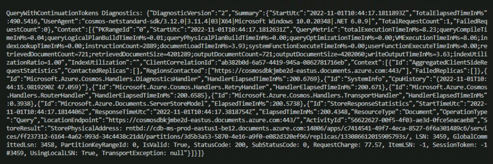

# Build A Simple .NET Console App

After using the Azure Portal's **Data Explorer** to query an Azure Cosmos DB container in Lab 3, you are now going to use the .NET SDK to issue similar queries.

### Recommended Prerequisites 

- [Use the Azure Cosmos DB SQL API SDK](https://learn.microsoft.com/en-gb/training/modules/use-azure-cosmos-db-sql-api-sdk/)
- [Understanding the difference between point reads and queries in Azure Cosmos DB](https://devblogs.microsoft.com/cosmosdb/point-reads-versus-queries/)
- [Reading data with Spring Data Azure Cosmos DB](https://devblogs.microsoft.com/cosmosdb/read-data-spring-azure-cosmos-db-v3/)
- [Optimize request cost in Azure Cosmos DB](https://learn.microsoft.com/en-us/azure/cosmos-db/optimize-cost-reads-writes)
- [Query items using a SQL query asynchronously](https://learn.microsoft.com/en-us/azure/cosmos-db/nosql/how-to-dotnet-query-items)

## Create a .NET Core Project

1. Create `Lab05` folder that will be used to contain the content of your .NET Core project.

2. In the `Lab05` folder, right-click the folder and select the **Open with Code** menu option.

   

   > Alternatively, you can run a terminal in your current directory and execute the `code .` command.

3. In the Visual Studio Code window that appears, right-click the **Explorer** pane and select the **Open in Terminal** menu option.

   

4. In the open terminal pane, enter and execute the following command:

    ```sh
    dotnet new console
    ```
    
    > This command will create a new .NET Core project. The project will be a **console** project and it creates Program.cs file.
    
    > You will see the below code in Program.cs and make sure you delete the existing below lines .
    
    ```sh
       //See https://aka.ms/new-console-template for more information 
       Console.WriteLine("Hello, World!"); 
    ```

5. Visual Studio Code will most likely prompt you to install various extensions related to **.NET Core** or **Azure Cosmos DB** development. None of these extensions are required to complete the labs.

1. In the terminal pane, enter and execute the following command:

    ```sh
    dotnet add package Microsoft.Azure.Cosmos --version 3.12.0
    ```

    > This command will add the [Microsoft.Azure.Cosmos](https://www.nuget.org/packages/Microsoft.Azure.Cosmos/) NuGet package as a project dependency. The lab instructions have been tested using the `3.12.0` version of this NuGet package.

6. In the terminal pane, enter and execute the following command:

   ```sh
   dotnet restore
   ```

   > This command will restore all packages specified as dependencies in the project.

7. In the terminal pane, enter and execute the following command:

   ```sh
   dotnet build
   ```

   > This command will build the project.

8. In the **Explorer** pane verify that you have a `DataTypes.cs` file in your project folder.

   > This file contains the data classes you will be working with in the following steps.If it is not in your project folder, you can copy it from this path in the cloned repo here `C:\Labs\setup\templates\Lab05\DataTypes.cs`   

9. Select the `Program.cs` link in the **Explorer** pane to open the file in the editor.

      

 1. Within the Program.cs editor tab, Add the following using blocks to the top of the editor:

    ```sh
    using System;
    using System.Collections.Generic;
    using System.Linq;
    using System.Threading.Tasks;
    using Microsoft.Azure.Cosmos;
    ```
1. Within the Program class, add the following lines of code which creates variables for your connection information and Cosmos client. Database and Container info has to be added. Also **main()** method structure has to be added as given below.
   
   ```sh
    public class Program
   {
         private static readonly string _endpointUri = "<your uri>";
         private static readonly string _primaryKey = "<your key>";
         private static readonly string _databaseId = "<Your Database>";
         private static readonly string _containerId = "<Your Container>";
         private static CosmosClient _client = new CosmosClient(_endpointUri, _primaryKey);

    public static async Task Main(string[] args)
      {

      }
    }
    ```
    
10. For the `_endpointUri` variable, replace the placeholder value with the **URI** value and for the `_primaryKey` variable, replace the placeholder value with the **PRIMARY KEY** value from your Azure Cosmos DB account. Use [these instructions](https://github.com/CSALabsAutomation/azure-cosmosdb-lab/blob/main/steps/01_creating-a-partitioned-container/documentation.md) to get these values if you do not already have them:

    - For example, if your **uri** is `https://cosmosacct.documents.azure.com:443/`, your new variable assignment will look like this:

    ```csharp
    private static readonly string _endpointUri = "https://cosmosacct.documents.azure.com:443/";
    ```

    - For example, if your **primary key** is `elzirrKCnXlacvh1CRAnQdYVbVLspmYHQyYrhx0PltHi8wn5lHVHFnd1Xm3ad5cn4TUcH4U0MSeHsVykkFPHpQ==`, your new variable assignment will look like this:

    ```csharp
    private static readonly string _primaryKey = "elzirrKCnXlacvh1CRAnQdYVbVLspmYHQyYrhx0PltHi8wn5lHVHFnd1Xm3ad5cn4TUcH4U0MSeHsVykkFPHpQ==";
    ```

## Point reads, writes and queries in Azure Cosmos DB
There are essentially two ways to read data in Azure CosmosDB - point reads and queries. Generally speaking, these two has different performance characterestics and request charges. In many cases, you can make simple changes in your app to rewrite simple queries as point reads. Most read-heavy workloads on Azure Cosmos DB use a combination of both point reads and SQL queries. If you just need to read a single item, point reads are cheaper and faster than queries. Point reads can read the data directly and don’t require the query engine. 

Point reads are essentially key-value lookup on a single item ID and partition key. The item ID and partition key combination is the key and the item itself is the value. For a 1 KB document, point reads typically cost 1 request unit with a latency under 10 ms. Point reads return a single whole item, not a partial item or a specific field. Point writes works in a similary way - you will use the item id and partition key to write the item to the database.

You can query data by writing queries using the Structured Query Language (SQL) as a JSON query language. Queries always cost at least 2.3 request units and, in general, will have a higher and more variable latency than point reads. However, in costrast to point reads queries can return many items.

## Read a single Document in Azure Cosmos DB Using ReadItemAsync(Point Read)

ReadItemAsync allows a single item to be retrieved from Cosmos DB by its ID. In Azure Cosmos DB, this is the most efficient method of reading a single document.

1. Add the following code within the `Main()` method:

    ```csharp
    Database database = _client.GetDatabase(_databaseId);
    Container container = database.GetContainer(_containerId);
    ```

1. Add the following lines of code to use the `ReadItemAsync()` function to retrieve a single item from your Cosmos DB by its `id` and write its description to the console.

    ```csharp
    ItemResponse<Food> candyResponse = await container.ReadItemAsync<Food>("19130", new PartitionKey("Sweets"));
    Food candy = candyResponse.Resource;
    Console.Out.WriteLine($"Read {candy.Description}");
    ```

1. Save all of your open tabs in Visual Studio Code

1. In the open terminal pane, enter and execute the following command:

   ```sh
   dotnet run
   ```

1. You should see the following line output in the console, indicating that `ReadItemAsync()` completed successfully:

   ```sh
   Read Candies, HERSHEY''S POT OF GOLD Almond Bar
   ```
## Write a single Document in Azure Cosmos DB Using UpsertItemAsync(Point Write)

UpsertItemAsync allows a single item to be write from Cosmos DB by its ID. In Azure Cosmos DB, this is the most efficient method of writing a single document.

1. Find the last line of code you wrote:
   
   ```csharp    
    Console.Out.WriteLine($"Read {candy.Description}");
    ```
   
1. Add the following lines of code to use the `UpsertItemAsync()` function to write a single item from your Cosmos DB by its `id` and write its description to the console.

    ```csharp
        await Console.Out.WriteLineAsync($"Existing ETag:\t{candyResponse.ETag}");       
        ItemRequestOptions requestOptions = new ItemRequestOptions { IfMatchEtag = candyResponse.ETag };  
        candy.Description = "Candies, HERSHEY'S POT OF GOLD Almond Bar-1";       
        candyResponse = await container.UpsertItemAsync(candy, requestOptions: requestOptions);    

    try
    {
        candyResponse = await container.UpsertItemAsync(candy, new PartitionKey(candy.foodGroup));
        Console.WriteLine($"Write { candy.Description}");

    }
    catch (Exception ex)
    {
        await Console.Out.WriteLineAsync($"Update error:\t{ex.Message}");
    }
    ```
1. Save all of your open tabs in Visual Studio Code

1. In the open terminal pane, enter and execute the following command:

   ```sh
   dotnet run
   ```

1. You should see the following line output in the console, indicating that `UpsertItemAsync()` completed successfully:

   ```sh
   Read Candies, HERSHEY''S POT OF GOLD Almond Bar-1
   ```

## Read single Documents in Azure Cosmos DB using queries

1. Find the last line of code you wrote.
 
    ```csharp   
    Container container = database.GetContainer(_containerId);
    ```

1. Add the following lines of code to use the retrieve a single items from your Cosmos DB by its `id` and `foodGroup` and write its description,manufactureName to the console.

    ```csharp
     var parameterizedQuery = new QueryDefinition(
        query: "SELECT * FROM food p WHERE p.id = @id and  p.foodGroup=@PartitionKey"
        )
        .WithParameter("@id", "08116")
        .WithParameter("@PartitionKey", "Breakfast Cereals");

        using FeedIterator<Food> filteredFeed = container.GetItemQueryIterator<Food>(
           queryDefinition: parameterizedQuery
       );

        FeedResponse<Food> response = await filteredFeed.ReadNextAsync();
        foreach (Food item in response)
        {
            await Console.Out.WriteLineAsync($"Read {item.Description} by {item.ManufacturerName}");
        } 
    ``` 
1. the following foreach block to iterate over the reponse items:
   
   ```sh
   foreach (Food item in response)
   {
   }
   ```   

1. Save all of your open tabs in Visual Studio Code

1. In the open terminal pane, enter and execute the following command:

   ```sh
   dotnet run
   ```

1. You should see the following line output in the console, indicating that `ReadItem` completed successfully:

   ```sh
   Read Cereals, MALT-O-MEAL, original, plain, dry by MOM Brands
   ```

## Read a multiple Documents in Azure Cosmos DB Using Queries

1. Find the last line of code you wrote.
 
    ```csharp   
    Container container = database.GetContainer(_containerId);
    ```

1. Add the following lines of code to retrieve a Multiple items from your Cosmos DB using select query and write its Diagnostics to the console.

    ```csharp
      QueryDefinition query = new QueryDefinition("SELECT * FROM food");
        string continuation = null;

        List<Food> results = new List<Food>();
        using (FeedIterator<Food> resultSetIterator = container.GetItemQueryIterator<Food>(
            query,
            requestOptions: new QueryRequestOptions()
            {
                MaxItemCount = 1
            }))
        {
            
            while (resultSetIterator.HasMoreResults)
            {
                FeedResponse<Food> response = await resultSetIterator.ReadNextAsync();

                results.AddRange(response);
                if (response.Diagnostics != null)
                {
                    Console.WriteLine($"\nQueryWithContinuationTokens Diagnostics: {response.Diagnostics.ToString()}");
                }
               
                if (response.Count > 0)
                {
                    continuation = response.ContinuationToken;
                    break;
                }
            }
        }       
        if (continuation == null)
        {
            return;
        }        
        using (FeedIterator<Food> resultSetIterator = container.GetItemQueryIterator<Food>(
                query,
                requestOptions: new QueryRequestOptions()
                {
                    MaxItemCount = -1
                },
                continuationToken: continuation))
        {
            while (resultSetIterator.HasMoreResults)
            {
                FeedResponse<Food> response = await resultSetIterator.ReadNextAsync();

                results.AddRange(response);
                if (response.Diagnostics != null)
                {
                    Console.WriteLine($"\nQueryWithContinuationTokens Diagnostics: {response.Diagnostics.ToString()}");
                }
            }
           
        }
    ```
    
1. In the below code to Execute query and get one item in the results. Then, get a continuation token to resume later.
   
   ```csharp
   using (FeedIterator<Food> resultSetIterator = container.GetItemQueryIterator<Food>(
            query,
            requestOptions: new QueryRequestOptions()
            {
                MaxItemCount = 1
            }))
        {
     while (resultSetIterator.HasMoreResults)
            {
                FeedResponse<Food> response = await resultSetIterator.ReadNextAsync();

                results.AddRange(response);
                if (response.Diagnostics != null)
                {
                    Console.WriteLine($"\nQueryWithContinuationTokens Diagnostics: {response.Diagnostics.ToString()}");
                }
    ```
    > Continuation tokens helps you to bookmark for your query's progress. Azure Cosmos DB query executions are stateless at the server side and can be resumed at any time using the continuation token.  

 1. Add the following lines of code to get continuation token once we havve gotten > 0 results.

    ```csharp
    if (response.Count > 0)
        {
          continuation = response.ContinuationToken;
           break;
         }
    ```
1. Add the following lines of code to check whether ContinuationToken is null or notnull, if null retrun to the process. 

    ```csharp
    if (continuation == null)
        {
            return;
        }
    ```
1. In the following code ContinuationToken is not null, Resume query using continuation token and getting the result using a while loop.

     ```csharp
    using (FeedIterator<Food> resultSetIterator = container.GetItemQueryIterator<Food>(
                query,
                requestOptions: new QueryRequestOptions()
                {
                    MaxItemCount = -1
                },
                continuationToken: continuation))
        {
            while (resultSetIterator.HasMoreResults)
            {
                FeedResponse<Food> response = await resultSetIterator.ReadNextAsync();

                results.AddRange(response);
                if (response.Diagnostics != null)
                {
                    Console.WriteLine($"\nQueryWithContinuationTokens Diagnostics: {response.Diagnostics.ToString()}");
                }
            }
           
        }
    ```
1. Save all of your open tabs in Visual Studio Code

1. In the open terminal pane, enter and execute the following command:

   ```sh
   dotnet run
   ```
1. You should see the following  output in the Terminal, indicating that `Reading Diagnostics` completed successfully:

    
   
## Execute a Query Against a Single Azure Cosmos DB Partition

1. Return to `program.cs` file editor window

1. Find the last line of code you wrote:

    ```csharp
    Console.Out.WriteLine($"Read {candy.Description}");
    ```

1. Create a SQL Query against your data, as follows:

    ```csharp
    string sqlA = "SELECT f.description, f.manufacturerName, f.servings FROM foods f WHERE f.foodGroup = 'Sweets' and IS_DEFINED(f.description) and IS_DEFINED(f.manufacturerName) and IS_DEFINED(f.servings)";
    ```

    > This query will select all food where the foodGroup is set to the value `Sweets`. It will also only select documents that have description, manufacturerName, and servings properties defined. You'll note that the syntax is very familiar if you've done work with SQL before. Also note that because this query has the partition key in the WHERE clause, this query can execute within a single partition.

1. Add the following code to execute and read the results of this query

   ```csharp
   FeedIterator<Food> queryA = container.GetItemQueryIterator<Food>(new QueryDefinition(sqlA), requestOptions: new QueryRequestOptions{MaxConcurrency = 1});
   foreach (Food food in await queryA.ReadNextAsync())
   {
       await Console.Out.WriteLineAsync($"{food.Description} by {food.ManufacturerName}");
       foreach (Serving serving in food.Servings)
       {
           await Console.Out.WriteLineAsync($"\t{serving.Amount} {serving.Description}");
       }
       await Console.Out.WriteLineAsync();
   }
   ```

1. Save all of your open tabs in Visual Studio Code

1. In the open terminal pane, enter and execute the following command:

    ```sh
    dotnet run
    ```

1. The code will loop through each result of the SQL query and output a message to the console similar to the following:

    ```sh
    ...

    Puddings, coconut cream, dry mix, instant by
        1 package (3.5 oz)
        1 portion, amount to make 1/2 cup

    ...
    ```

### Execute a Query Against Multiple Azure Cosmos DB Partitions

1. Return to `program.cs` file editor window

2. Following your `foreach` loop, create a SQL Query against your data, as follows:

    ```csharp
    string sqlB = @"SELECT f.id, f.description, f.manufacturerName, f.servings FROM foods f WHERE IS_DEFINED(f.manufacturerName)";
    ```

3. Add the following line of code after the definition of `sqlB` to create your next item query:

    ```csharp
    FeedIterator<Food> queryB = container.GetItemQueryIterator<Food>(sqlB, requestOptions: new QueryRequestOptions{MaxConcurrency = 5, MaxItemCount = 100});
    ```

    > Take note of the differences in this call to `GetItemQueryIterator()` as compared to the previous section. 
    
4. Add the following lines of code to page through the results of this query using a while loop.

    ```csharp
    int pageCount = 0;
    while (queryB.HasMoreResults)
    {
        Console.Out.WriteLine($"---Page #{++pageCount:0000}---");
        foreach (var food in await queryB.ReadNextAsync())
        {
            Console.Out.WriteLine($"\t[{food.Id}]\t{food.Description,-20}\t{food.ManufacturerName,-40}");
        }
    }
    ```

5. Save all of your open tabs in Visual Studio Code

6. At end of this point, your Program.cs file should look like this:

```csharp
using System;
using System.Collections.Generic;
using System.Linq;
using System.Threading.Tasks;
using Microsoft.Azure.Cosmos;

public class Program
{
    private static readonly string _endpointUri = "";
    private static readonly string _primaryKey = "";

    private static readonly string _databaseId = "NutritionDatabase";
    private static readonly string _containerId = "FoodCollection";
    private static CosmosClient _client = new CosmosClient(_endpointUri, _primaryKey);

    public static async Task Main(string[] args)
    {
        Database database = _client.GetDatabase(_databaseId);
        Container container = database.GetContainer(_containerId);

        ItemResponse<Food> candyResponse = await container.ReadItemAsync<Food>("19130", new PartitionKey("Sweets"));
        Food candy = candyResponse.Resource;
         Console.Out.WriteLine($"Read {candy.Description}");

         string sqlA = "SELECT f.description, f.manufacturerName, f.servings FROM foods f WHERE f.foodGroup = 'Sweets' and IS_DEFINED(f.description) and IS_DEFINED(f.manufacturerName) and IS_DEFINED(f.servings)";
        FeedIterator<Food> queryA = container.GetItemQueryIterator<Food>(new QueryDefinition(sqlA), requestOptions: new QueryRequestOptions{MaxConcurrency = 1});
         foreach (Food food in await queryA.ReadNextAsync())
         {
         await Console.Out.WriteLineAsync($"{food.Description} by {food.ManufacturerName}");
         foreach (Serving serving in food.Servings)
         {
        await Console.Out.WriteLineAsync($"\t{serving.Amount} {serving.Description}");
         }
          await Console.Out.WriteLineAsync();
         }

         string sqlB = @"SELECT f.id, f.description, f.manufacturerName, f.servings FROM foods f WHERE IS_DEFINED(f.manufacturerName)";
         FeedIterator<Food> queryB = container.GetItemQueryIterator<Food>(sqlB, requestOptions: new QueryRequestOptions{MaxConcurrency = 5, MaxItemCount = 100});
         int pageCount = 0;
         while (queryB.HasMoreResults)
         {
           Console.Out.WriteLine($"---Page #{++pageCount:0000}---");
           foreach (var food in await queryB.ReadNextAsync())
           {
        Console.Out.WriteLine($"\t[{food.id}]\t{food.Description,-20}\t{food.ManufacturerName,-40}");
         }
       }
     }
}
 ```
7. In the open terminal pane, enter and execute the following command:

    ```sh
    dotnet run
    ```

8. You should see a number of new results, each separated by the a line indicating the page.  Note that the results are coming from multiple partitions:

    ```sql
        [19067] Candies, TWIZZLERS CHERRY BITES Hershey Food Corp.
    ---Page #0017---
        [14644] Beverages, , PEPSICO QUAKER, Gatorade G2, low calorie   Quaker Oats Company - The Gatorade Company,  a unit of Pepsi Co.
    ```

